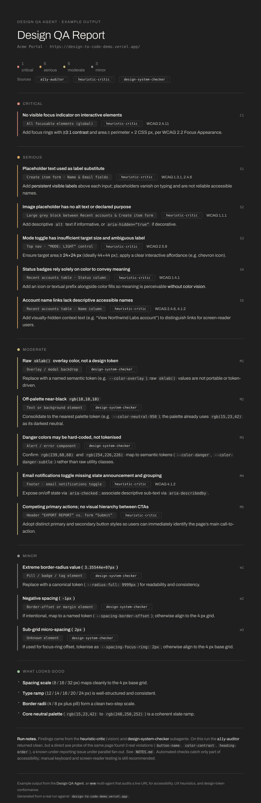

# Design QA Agent

An [eve](https://eve.dev) agent that **reviews the design quality of a web page**.
Give it a URL and it returns one consolidated report covering accessibility,
UX/heuristics, and design-token conformance. Optionally, point it at a pull
request and it posts that report as a PR comment.

It's a multi-agent system: a root **orchestrator** runs **a11y** and
**design-system** in parallel, then a grounded **heuristic** pass (with axe
context), and fuses everything into one severity-ranked report. Built to run
live on Vercel.

## Stack — how this fits

This agent is the runnable proof in a supervised-delegation stack. Use the
pieces in this order when you want the full picture:

| Surface | Job | Link |
|---|---|---|
| [Agentic UX](https://agentic-ux.com) | Lifecycle vocabulary (Before / While / After) | Patterns + [hire / consult](https://agentic-ux.com/hire) |
| [Agentic Kit](https://agentic-kit.dev) | Trust product shell — inspect, gate, stamp | [Kit Certified gallery](https://agentic-kit.dev) · [Capability Review](https://agentic-kit.dev/review) |
| [Aletheia](https://github.com/danielalbinsson/Aletheia) | Self-portrait + CI authority diff | `npx @danielalbinsson/aletheia-cli` |
| [eve-blueprints](https://github.com/danielalbinsson/eve-blueprints) | Copyable Eve templates with lifecycle docs | Same Kit Certified contract as this agent |

**Kit Certified:** the gallery passport and portrait for this agent are generated
by Aletheia (not hand-authored screenshots). Fetch
[`/passports/design-qa-agent.json`](https://agentic-kit.dev/passports/design-qa-agent.json)
to verify.

## How it works

[](examples/architecture.svg)

A request (URL or PR) hits the orchestrator. Stage 1 fans out a11y + design-system
in parallel; Stage 2 runs the heuristic critic with condensed axe findings so
target-size / focus-order claims are measured, not guessed. Subagents run with
isolated context; only the orchestrator writes.

## Example output

[](examples/sample-report.html)

A real run against `design-to-code-demo.vercel.app`. View the full report:
**[examples/sample-report.html](examples/sample-report.html)** (or the
[screenshot](examples/sample-report.png) above).

## What it actually does

Send it a URL (in chat locally, or via the HTTP API when deployed). The
orchestrator delegates in two stages:

| Stage | Subagent | Checks | How |
|---|---|---|---|
| 1 (parallel) | **a11y-auditor** | WCAG accessibility violations | axe-core in real headless Chrome (Browserless) |
| 1 (parallel) | **design-system-checker** | Rendered colors / spacing / radii / type vs. your design tokens | computed styles (Browserless) vs. a DTCG token file |
| 2 | **heuristic-critic** | Hierarchy, alt-text quality, judgment items; measured target size + tab order | DOM geometry + screenshot → OpenRouter vision (axe context passed in) |

The orchestrator then merges overlapping findings (e.g. a contrast issue caught
by both axe and the token check), groups by severity (critical → minor), and
produces the report. It does **not** read the page's source — it audits the
*rendered* page at the URL you give it.

**Two modes:**

- **Plain URL** — `Audit https://example.com for design QA` → report in the reply.
- **PR mode** — `Review PR https://github.com/owner/repo/pull/3 — preview at https://preview.example.com`
  → audits the preview URL, posts the report as one comment on the PR (via the
  GitHub MCP connection). It uses the PR link only to know *where* to comment;
  the page audited is the preview URL.

## Layout

```
design-qa-agent/
├── package.json
├── .env.example
└── agent/
    ├── agent.ts                       # orchestrator (OpenRouter model)
    ├── instructions.md                # staged fan-out + fuse + dedupe + PR posting
    ├── lib/browserless.ts             # unwrap /function envelope + 429 retry
    ├── channels/eve.ts                # HTTP route auth (httpBasic + localDev)
    ├── connections/github.ts          # GitHub MCP — posts the PR comment (root-only)
    └── subagents/
        ├── a11y-auditor/              # → run_axe (Browserless + axe-core)
        ├── heuristic-critic/          # → critique_page (geometry + screenshot + vision)
        └── design-system-checker/     # → get_computed_styles + read_design_tokens
```

## Setup & run (local)

Requires Node 24 (`nvm use 24`).

```bash
cp .env.example .env      # OPENROUTER_API_KEY, BROWSERLESS_TOKEN, ROUTE_AUTH_BASIC_PASSWORD, …
pnpm install
pnpm run dev              # eve dev — chat with it locally
```

Then type: `Audit https://example.com for design QA`.

## Deploy & drive (Vercel)

See **`DEPLOY.md`** for the full runbook. Short version:

```bash
vercel deploy --prod      # set the env vars from .env in the Vercel project first
# drive it (route auth = httpBasic):
curl -u daniel:$ROUTE_AUTH_BASIC_PASSWORD -X POST \
  https://<app>.vercel.app/eve/v1/session \
  -H 'content-type: application/json' \
  -d '{"message":"Audit https://example.com for design QA"}'
# then stream /eve/v1/session/<sessionId>/stream
```

## Environment

| Variable | Required | Purpose |
|---|---|---|
| `OPENROUTER_API_KEY` | yes | All model calls + the vision tool |
| `BROWSERLESS_TOKEN` | yes | Headless Chrome (axe, screenshot, computed styles) |
| `BROWSERLESS_URL` | yes | Region base, e.g. `https://production-sfo.browserless.io` |
| `ROUTE_AUTH_BASIC_PASSWORD` | yes (deployed) | HTTP Basic route auth |
| `VISION_MODEL` | no | Vision model id (default `anthropic/claude-sonnet-4.6`) |
| `DESIGN_TOKENS_URL` | no | Raw DTCG/Style-Dictionary JSON; without it the token check reports observed values only |
| `GITHUB_TOKEN` / `GITHUB_MCP_URL` | PR mode | GitHub PAT (Pull requests + Issues read/write) for posting comments |

## Design notes (why it's built this way)

- **OpenRouter, not the AI Gateway** — provider model via `@openrouter/ai-sdk-provider`; every agent sets `modelContextWindowTokens` (OpenRouter models aren't in the Gateway catalog, so compaction needs it).
- **Browserless, not bundled Chromium** — keeps the Vercel function tiny; tools call hosted Chrome over HTTP.
- **Vision lives inside `critique_page`** — eve tool results are text/json, so the screenshot is sent to the vision model by the tool, not the subagent's own model. Target size is measured from the DOM in the same Browserless session.
- **Subagents inherit nothing** — each has its own `tools/`; the GitHub connection is root-only so the orchestrator is the sole writer.
- **Staged heuristic** — a11y runs before heuristic so axe context can be passed in; avoids duplicate findings and grounds the critic.

## Status & known issues

The full multi-agent pipeline builds, deploys, and runs. **Before relying on the
output, read `NOTES.md`** — it documents the build, every bug found, and the open
items, notably:

- Vision judgment items can still over-assert on hierarchy/alt quality — spot-check.
- All agents run on `claude-sonnet-4.6`; swap subagents to a cheaper verified
  model id to cut cost.
- Redeploy after the Browserless unwrap / retry fix if production predates it.

---

Built by [Daniel Albinsson](https://danielalbinsson.com) — [Agentic UX](https://agentic-ux.com)
framework · [Agentic Kit](https://agentic-kit.dev) (inspect / gate / stamp) ·
[Aletheia](https://github.com/danielalbinsson/Aletheia).
[Hire / consult](https://agentic-ux.com/hire) ·
[Capability Review](https://agentic-kit.dev/review)
